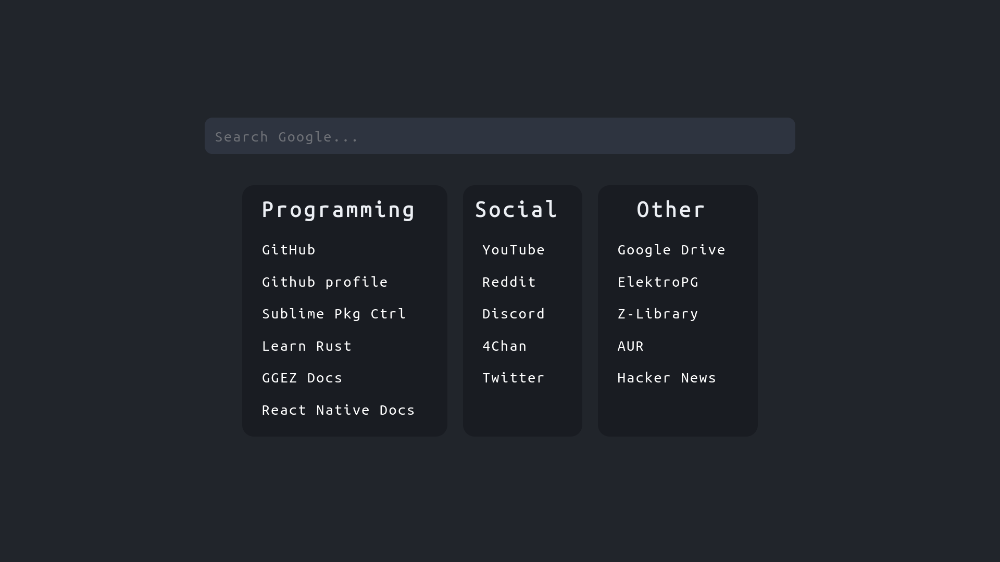

# Start Page

My custom browser start page.

## Screenshot:



## Change Links:

```<p>NAME OF SECTION</p>
<a class="link" href="LINKTOWEBSITE">NAMEOFWEBSITE</a>
```

## Font:

https://www.programmingfonts.org/#ubuntu
